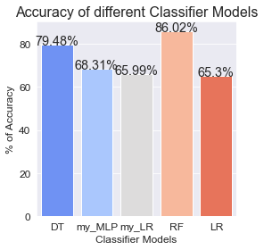
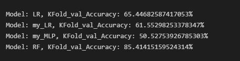
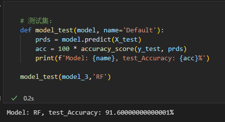
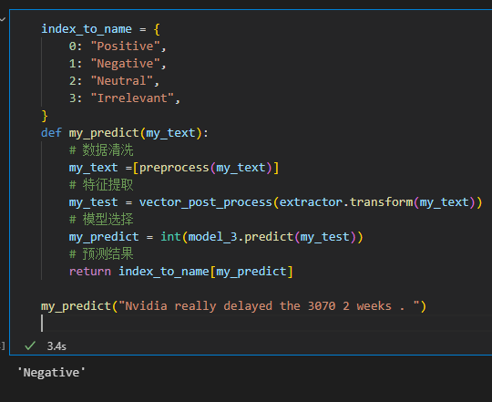

# 人工智能导论第二次作业-分类实践

代码见 `p5/playground.ipynb`

### 数据处理   
* 去除文本中除了字母，数字和空格之外的内容，并把大写字母变小写。

### 特征工程
* SKlearn 提供了两种特征提取的方法，分别是词频和 TF-IDF，但是这两种方法有一个共同问题在于所提取出的特征数量较大，为 30436。
* 特征数量大必然导致数据集矩阵较大，此时使用密集矩阵易导致内存不足，需要使用稀疏矩阵所以 `import sparse`，然后在类 `ManualVectorizer` 重新实现 `CountVectorizer`，不过速度相较于 Sklearn 提供 `CountVectorizer` 慢了不少，可以使用 `manual_extractor.fit_transform(test_data.clearn)` 验证该方法。不过在后面的过程中我选择使用 `TfidfVectorizer`。
* 然后就是特征降维操作，分别有恒等映射，hash，随机矩阵乘法和我自己实现的 PCA 方法，但是我用后两种方法不是很理想，所以最终选择 hash。
  
### 模型选择
* 使用 `train_test_split` 把数据集划分为训练集和验证集，大小比例为9；1。
* 我选择的四个机器学习分类器分别是决策树，MLP，逻辑回归和随机森林（因为支持向量机训练的时间太长了，3个小时没跑完），其中我手动实现了MLP，逻辑回归分类器的搭建。

* 各个分类器在验证集上的正确率：  
  
  训练一次所需要时间：  
    |DT|my_MLP|my_LR|RF|LR|
    |-|-|-|-|-|
    |24m53.4s|1m22.5s|14.6s|2m36.9s|46.4s|

* 同时我是用了 K 折交叉验证对各个模型进行测试（除了决策树，因为运行时间实在较长）正确率结果如下：  
    |my_MLP|my_LR|RF|LR|
    |-|-|-|-|
    |50.5%|61.6%|85.4%|65.4%|

      
    发现 my_MLP 和 my_LR 在 K 折交叉验证相较于直接在验证集上正确率存在差距，猜测原因是我用的是 5 折交叉验证，与之前 9：1 的划分比例不一致，但是随机森林依旧是最好的分类器。

* 调参的时候，我发现 MLP 和逻辑回归的在验证集正确率与初始化方式有较大的关系，但是最后正确率相较于决策树和随机森林较低，于是我对比了 SKlearn 提供的 `LogisticRegression`，发现自己的结果还算可以。

* 最终选择在验证集上正确率最高的随机森林 `model_3:RF` 作为最终的模型。

### 测试评估
使用 `model_3 = RandomForestClassifier(n_estimators=8)` 在测试集上运行的结果如下：

测试集正确率为 91.6%。  

此外，我在最后实现了人工测试接口，可以输入一段文本来预测情绪。 

